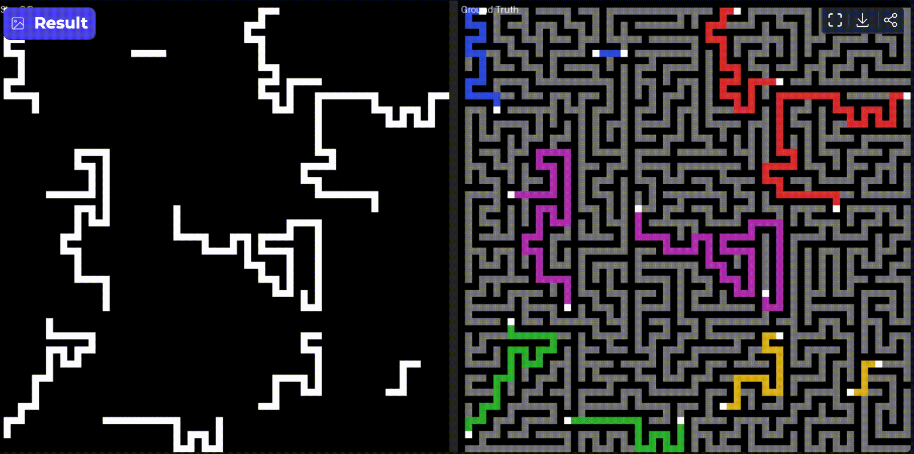

# DiffuMaze
Multi-goal, multi-layer maze generation and neural network solving.



```
├── generator/     # Rust CLI — generates maze datasets
└── solver/        # Python — neural network solvers
```

---

## Generator (`generator/`)

Creates maze puzzles with multiple routes, multiple layers (floors), and inter-layer connections (vias). Routes share the same map but never cross within a layer. Each route has checkpoints it must pass through.

**Output**: Safetensors files with puzzle walls + solution paths, ready for ML training.

```bash
cd generator
cargo run --release -- -w 64 -h 64 -l 2 -g 2 -n 5 -o puzzles.safetensors
```

| Flag | What it does |
|------|-------------|
| `-w` / `-h` | Maze size in cells |
| `-l` | Number of layers (floors) |
| `-g` | Number of routes per map |
| `-c` | Checkpoints per route |
| `-v` | Vias (inter-layer holes) per route |
| `-n` | Number of maps to generate |
| `-r` | Render PNGs to this directory |

Run `cargo run --release -- --help` for all options.

---

## Solver (`solver/`)

Three different neural approaches to solve the generated mazes, sharing the same data format.

### Direct — One-Shot Prediction

Fastest approach: the model sees the puzzle and predicts the solution in one pass.

```bash
cd solver/Direct
python train.py --model unet --epochs 50
python infer.py --model unet --checkpoint <path>
```

### FlowMatching — Iterative Denoising (UNet)

Learns to gradually turn noise into a solution, conditioned on the puzzle. Slower but more expressive than one-shot.

```bash
cd solver/FlowMatching
python train.py --model unet --epochs 100
python infer.py --model unet --checkpoint <path> --solver euler --num-steps 100
```

### FlowMatching_Trans — Iterative Denoising (Transformer)

Same denoising approach as above, but uses a Transformer instead of a UNet. Most expressive variant. Supports multiple model sizes including a VAE-augmented version.

```bash
cd solver/FlowMatching_Trans
python train.py --model trans_small_rope --epochs 100
python infer.py --model trans_small_rope --checkpoint <path>
```

### Model Sizes

| Approach | Sizes available |
|----------|----------------|
| Direct | unet, unet_small, unet_xsmall, unet_xxsmall |
| FlowMatching | unet, unet_small, unet_xsmall, unet_xxsmall |
| FlowMatching_Trans | trans_small, trans_xsmall, trans_xxsmall, plus `_rope` variants and `trans_small_rope_vae` |

### Monitoring

Training is logged with [Aim](https://aimstack.io/). Start the dashboard:

```bash
aim up
```

---

## Data Format

All components use the same schema:

| Tensor | Shape | What it is |
|--------|-------|------------|
| `puzzle` | `(N, L, G+1, H, W)` | Walls (channel 0) + checkpoints per route (channels 1..G) |
| `solution` | `(N, L, H, W)` | Binary solution paths |

N = number of maps, L = layers, G = routes, H/W = height/width.

---

## License

MIT
