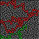
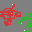

# Multi-goal multi-layer non-intersecting maze map generator
This is a Rust maze map generator that creates multi-goal, multi-layer, non-intersecting maze maps. The results will be saved as int8 Safetensors file.

## Safetensors Schema

The output file contains two tensors:

### `puzzle` — shape `(n, l, g+1, h, w)`, dtype `int8`

- `n`: number of maps
- `l`: layers per map
- `g+1`: channels (channel 0 + g route checkpoint channels)
- `h`: height
- `w`: width

| Channel | Description | Values |
|---------|-------------|--------|
| `0` | Walls | `1` = wall, `0` = passage |
| `1..g` | Route checkpoints | `1` = checkpoint/via position for that route, `0` = otherwise |

### `solution` — shape `(n, l, h, w)`, dtype `int8`

| Value | Meaning |
|-------|---------|
| `1` | Part of any route's solution path |
| `0` | Not on any solution path |

Checkpoints are marked in the corresponding route's channel (`1..g`). Vias (through-holes connecting layers) are also marked as checkpoint positions — they appear in the same channel as the route they belong to.

## Parameters
- `-w <width>`: The width of the maze map. Default 64
- `-h <height>`: The height of the maze map. Default 64
- `-l <layer>`: The number of layers in the maze map. Default 2
- `-g <goal>`: The number of distinct routes to generate in the maze map. Default 2.
- `-c <checkpoint>`: The number of checkpoints per route. Must be greater than or equal to 2 (e.g., a setting of 2 means just a start point and an endpoint for that route). Total checkpoints in the map will be $g \times c$. Default 2.
- `-n <num>`: The number of maze maps to generate. Default 5.
- `-o <output>`: The output path to save the generated maze maps. Default "maze.safetensors".
- `-t <thread>`: The number of threads to use. Default is cpu core count - 1.
- `-r <image path>`: Render the maze solution as images for human, showing different routes with different colors. Default is not rendering. Default image path is "rendered/"
- `-v <via>`: The number of via you expect a solution route to pass through. Default 1, meaning the algorithm will try it's best to generate maps, which require 1 via in each route to solve. Note that for effeciency, the algorithm will not guarantee to generate maps with exact via number.

## About non-intersecting
No two routes will cross each other in the same layer. However, there is no restriction on the routes in different layers.

## Rendering Color Schema
When rendering with `-r`, the PNG images use the following colors:
- **Black** `[0,0,0]`: Walls
- **Gray** `[128,128,128]`: Maze passages not on any solution path
- **Route colors**: Solution path cells, each route gets a distinct color from the palette below
- **White** `[255,255,255]`: Checkpoints (start and end positions of routes)
- **Yellow** `[255,255,0]`: Vias (through-holes connecting layers)

Route color palette (applied cyclically for routes beyond 10):
| Route | Color |
|-------|-------|
| 0 | Red `[220,50,50]` |
| 1 | Green `[50,180,50]` |
| 2 | Blue `[50,80,220]` |
| 3 | Yellow-Green `[220,180,30]` |
| 4 | Purple `[180,50,180]` |
| 5 | Cyan `[50,180,180]` |
| 6 | Orange `[200,120,50]` |
| 7 | Magenta `[120,50,200]` |
| 8 | Lime `[50,200,100]` |
| 9 | Pink `[200,50,120]` |

# Example

